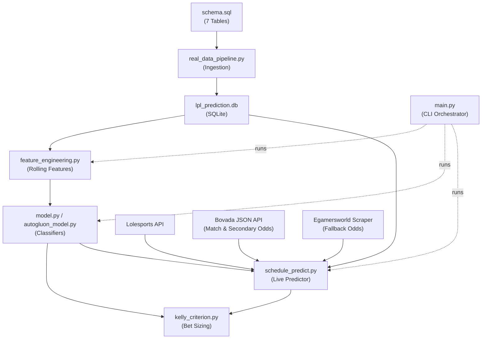

# League of Legends Prediction Machine (LPL & LCK)

A high-performance predictive analytics and quantitative betting system for League of Legends professional leagues (LPL and LCK). The system features state-of-the-art tabular classifiers, automated ensembling (AutoGluon), real-time schedule syncing, live bookmaker odds scraping (Bovada & Egamersworld), and bankroll management suggestions via the Kelly Criterion.

---

## 🚀 Key Features

*   **Data Pipeline & SQLite DB**: Automated ingestion and relational mapping of historical match datasets from Oracle's Elixir.
*   **Draft-Aware Feature Engineering**: Computes rolling ELO ratings, objective control rates (First Blood, Dragon, Tower), and rolling champion win rates (`Blue_DraftWinRate`, `Red_DraftWinRate`) chronologically before each match to prevent data leakage.
*   **State-of-the-Art Machine Learning**:
    *   *Classical ML*: Logistic Regression, Random Forest, XGBoost, and LightGBM with Grid Search hyperparameter tuning.
    *   *Deep Learning*: Custom PyTorch `TabAttention` classifier featuring a Multi-Head Self-Attention layer to capture complex nonlinear feature interactions.
    *   *AutoML Stacking*: Integrated **Amazon AutoGluon-Tabular** for stacked ensembling, optimized to leverage multi-GPU architectures (like NVIDIA H100) and large RAM environments.
    *   *LLM Fine-tuning*: Fine-tune **Qwen-2.5-14B-Instruct** using QLoRA on historical draft sequences, ELOs, and rolling team statistics. We extract normalized Softmax probabilities from the target logits (`"Blue"` vs `"Red"`) to feed win probabilities directly into the Kelly Criterion betting pipeline.
*   **Live Schedule & Caching**: Syncs upcoming schedules directly from the official **Lolesports API** with local caching to bypass rate limits.
*   **Real-time Odds Scraping**: Automatically extracts Match Winner, Map Handicap, Total Maps, and Correct Score odds from **Bovada's public JSON API** (with Egamersworld as a fallback scraper) and maps team spellings fuzzy-style.
*   **Secondary Market Probability Solver**: Utilizes best-of-3 (Bo3) and best-of-5 (Bo5) binomial distributions to calculate exact model probabilities for Map Handicaps, Total Maps, and Correct Scores.
*   **Interactive Betting Calculator**: Includes a command-line wizard (`--interactive`) allowing you to input odds seen on any bet site (e.g., Stake) to calculate optimal Kelly wager sizes.

---

## 🛠️ Architecture Overview



---

## 📦 Setup & Installation

### Linux / Ubuntu Setup
First, update the package list and install Git along with Python utilities:
```bash
sudo apt update && sudo apt install git python3-pip python3-venv python3.10-venv -y
```

### 1. Clone the repository
```bash
git clone https://github.com/minhnhzt/prediction-machine
cd prediction-machine
```

### 2. Create a virtual environment & install dependencies
```bash
python3 -m venv venv
. venv/bin/activate

pip install --upgrade pip
pip install -r requirements.txt
```
*Note: If running on a GPU platform (like FPT AI Factory H100), ensure CUDA-enabled PyTorch is installed.*

---

## 🎮 How to Use

### 1. Ingest historical data
To load historical CSV data into the SQLite database for a league (e.g. LPL):
```bash
python real_data_pipeline.py --csv "data/2025_LoL_esports_match_data_from_OraclesElixir.csv" --league LPL --fresh
```

### 2. Run model benchmarks
Evaluate default and tuned configurations of all models (LR, RF, XGBoost, LightGBM, TabAttention):
```bash
python main.py --league LPL --benchmark
```

### 3. Predict upcoming matches (with Live Odds & Kelly Wagers)
Retrieve the schedule for the next 3 days, scrape live odds, and compute Kelly suggestions:
```bash
# General match winner predictions
python main.py --league LPL --schedule

# Detailed view showing Map Handicaps, Total Maps, and Correct Score options
python main.py --league LPL --schedule --markets

# Specify a SOTA model (e.g. AutoGluon or XGBoost)
python main.py --league LPL --schedule --model autogluon --markets

# Predict schedule using Qwen 14B QLoRA model
python main.py --league LPL --schedule --model qwen_llm --markets
```

### 4. LLM Fine-Tuning (FPT Cloud H100)
To compile the training dataset from SQLite and run QLoRA fine-tuning on Qwen-2.5-14B-Instruct:
```bash
python main.py --league LPL --llm-train
```

### 5. Interactive Betting Calculator
Select a match, choose a market option (e.g., Score 2-1 or Handicap +1.5), input odds you see on Stake, and calculate optimal stakes:
```bash
python main.py --league LPL --interactive
```

---

## ⚙️ Project Structure

*   `main.py`: Unified entry point and CLI orchestrator.
*   `model.py`: Definitions of classical ML classifiers and PyTorch TabAttention network.
*   `autogluon_model.py`: Amazon AutoGluon-Tabular wrapper utilizing GPU stacking.
*   `llm_prepare_data.py`: Compiles LPL/LCK SQLite historical matches into conversational prompt files (`llm_train.jsonl`/`llm_val.jsonl`).
*   `llm_train.py`: Orchesrates QLoRA 4-bit fine-tuning of Qwen-2.5-14B-Instruct on H100 GPU.
*   `llm_predict.py`: Implements logit-based Softmax probability extractor from the fine-tuned LLM.
*   `feature_engineering.py`: Chronological ELO calculation, objective control tracking, and champion draft win-rate calculation.
*   `schedule_predict.py`: Handles Lolesports API matching, Bovada scraping, binomial probability solving, and detailed predictions.
*   `real_data_pipeline.py`: Populates SQLite database from CSV dumps.
*   `kelly_criterion.py`: Sizing engine using expected value and safety fractional caps.
*   `requirements.txt`: Project dependencies list.
